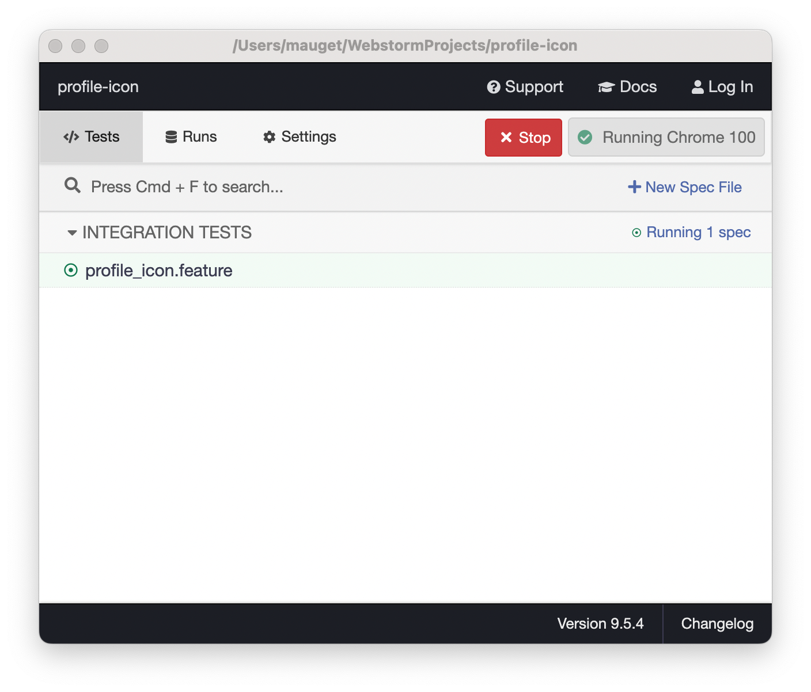
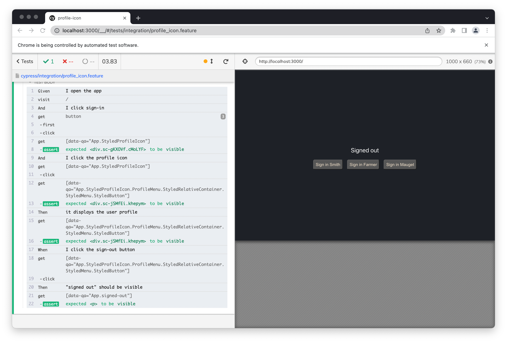

# Active Profile Icon

This project was bootstrapped with [Create React App](https://github.com/facebook/create-react-app).

## About
This app demonstrates a dynamic user profile icon. Its characteristics are:
+ A user profile icon created from a user profile object
+ The icon displays the initials of the user's first and last names
+ The user's intials drive the colors of the icon
+ A click on the icon displays the rendered profile
+ The profile has an active sign out item

## Demo Profile Object

```javascript
const userProfile = {
    username: 'bsmith',
    firstName: 'Bob',
    lastName: 'Smith',
    email: 'bsmith@zmail.com'
}
```
## Install
1. git Clone the project
2. `yarn install`

## Execute in Developer Mode
`yarn start` from project root to run in developer mode

## Build
`yarn build` creates `build` folder

## End-to-End Test
1. `yarn cy`
2. Wait for Cypress to open 
3. Click `profile_icon.feature` in _Integration Tests_

### Cypress Test Runner


### Cypress with Cucumber: `profile_icon.feature`


## Screens
Cycling through sign-in to profile icon and its click-up menu, and back to sign-in:
### Initial Screen


### Logged Into Session 


### Profile After Clicking Ioion


### After Clicking Sign Out in Profile

